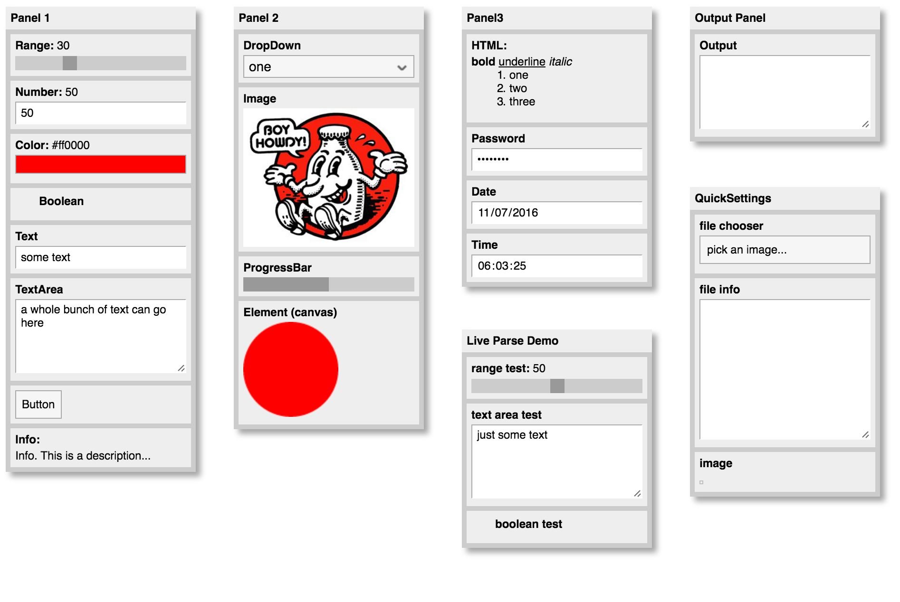

### [Haxe](http://haxe.org) extern classes for [QuickSettings](https://github.com/bit101/quicksettings).

 > QuickSettings is a JavaScript library for making a quick settings panel to control code parameters.



## Usage in Haxe

Add CDN hosted javascript to your HTML file. It's included with the default [quicksettings.css](https://raw.githubusercontent.com/bit101/quicksettings/master/quicksettings.min.css) so no need to add that.

```html
<script type="text/javascript" src="https://cdn.jsdelivr.net/quicksettings/latest/quicksettings.min.js"></script>
```

If you want to use a custom css, download and add the .[js](https://raw.githubusercontent.com/bit101/quicksettings/master/quicksettings.js) and one of the following [quicksettings_black.min.css](https://raw.githubusercontent.com/bit101/quicksettings/master/quicksettings_black.min.css) / [quicksettings_tiny.min.css](https://raw.githubusercontent.com/bit101/quicksettings/master/quicksettings_tiny.min.css) / [quicksettings_tiny_black.min.css](https://raw.githubusercontent.com/bit101/quicksettings/master/quicksettings_tiny_black.min.css) / [quicksettings_tiny_white.min.css](https://raw.githubusercontent.com/bit101/quicksettings/master/quicksettings_tiny_white.min.css) / [quicksettings_white.min.css](https://raw.githubusercontent.com/bit101/quicksettings/master/quicksettings_white.min.css) files in your HTML file.


```html
<!-- for example: use the quicksettings_tiny_black.min.css -->
<link rel="stylesheet" type="text/css" href="quicksettings_tiny_black.min.css">
<script type="text/javascript" src="quicksettings.js"></script>
```


# haxelib local use

Currently there is no haxelib, but you can use this git repos as a development directory:

```
haxelib dev hxquicksettings path/to/folder
```

or use git directly

```
haxelib git hxquicksettings https://github.com/MatthijsKamstra/hx-quicksettings.git
```

don't forget to add it to your build file

```
-lib hxquicksettings
```


In Haxe/JavaScript you can use the panel like this:
```haxe
import quicksettings.QuickSettings;

var settings:QuickSettings = QuickSettings.create(20, 20, "Settings");
```

Check out the [example](https://github.com/MatthijsKamstra/hx-quicksettings/blob/master/example/src/Main.hx) folder for more information.

**Enjoy!**

Read more at the original project: https://github.com/bit101/quicksettings
